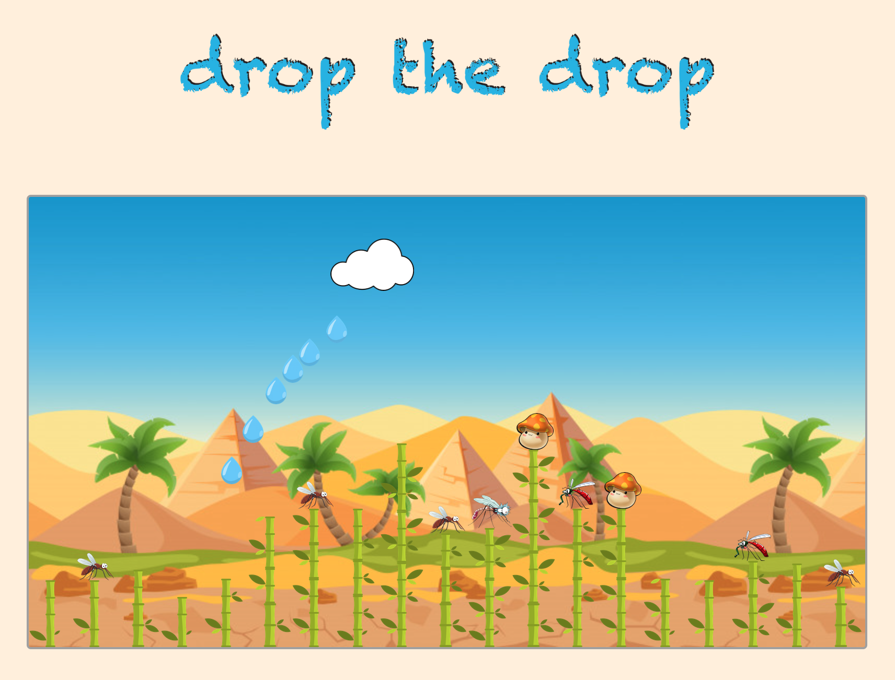

## About

Using React to build a basic game for Kids.
It is based on my other project City-Grame, but I decided to make a more friendly version of it.

I will use:
- React Hooks
- Styled components

## Getting started

- Clone the project
  ```
  yarn start
  ```


## Progress

